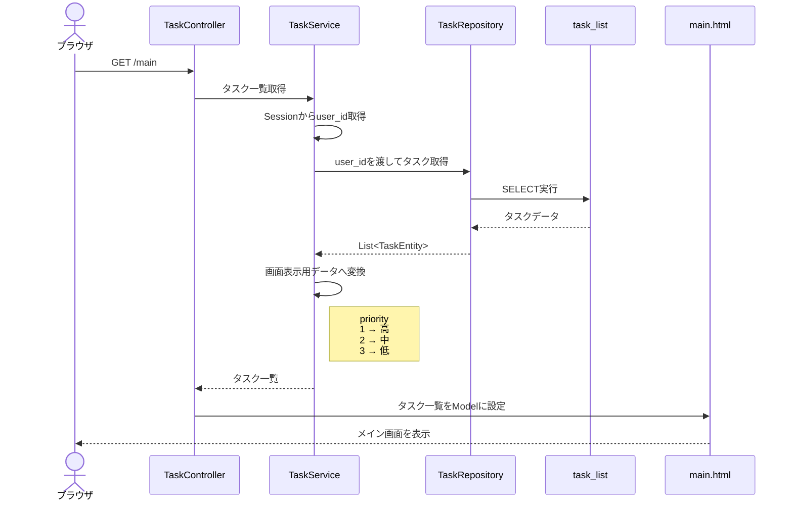

# 設計書　タスク一覧の画面表示

## アジェンダ

- [1. 概要](#1-概要)
- [2. テーブル設計](#2-テーブル設計)
- [3. データ取得処理](#3-データ取得処理)
- [4. Spring Boot クラス構成](#4-spring-boot-クラス構成)
- [5. 画面設計](#5-画面設計)
- [6. エラー・例外処理](#6-エラー例外処理)
- [7. 設計判断](#7-設計判断)
- [8. 実装範囲](#8-実装範囲)

## 1. 概要

本ドキュメントにおける設計の対象は下記

- Amazon RDS (MySQL)の設計（新規テーブル追加）
- タスク表示機能（新規機能）
- メイン画面の画面設計（仕様変更）

## 2. テーブル設計

ユーザーに紐づくタスクの情報を管理するテーブルを下記のように定義する。

- テーブル名：task_list

|No. | Column name | type | 桁 | description|
| --- | --- | --- | --- | --- | 
| 1 | task_id | int |  | レコードを一意に特定するID |
| 2 | user_id | varchar | 255 |　このタスクのユーザーのID（ユーザーとタスクを紐づける必要があるため） |
| 3 | task | varchar | 100 | 全角文字で100文字まで|
| 4 | due_date | date |  | 期限（yyyy-mm-dd形式） |
| 5 | priority | int | 1 | 1:高、2: 中、3：低|
| 6 | complete_flg | char | 1 |　1:完了、0:未完了 |
| 7 | del_flg | char | 1 | 1:削除済、0: 削除未実施 （将来的にタスク削除機能を実装する際、物理削除ではなく論理削除を行うため、del_flgを保持する。）|
| 8 | create_date | datetime |  | システム日付（データの管理のため）|
| 9 | update_date | datetime |  | システム日付（データの管理のため）|


## 3. データ取得処理

タスク一覧の取得で、いつ、どのテーブルから、何のデータを取得するかを定義する

### 3.1. 取得内容

| 項目    | 設計内容               |
| ----- | ------------------ |
| 取得対象  | タスク管理テーブル          |
| 取得条件  | ログインユーザーID、未完了タスク     |
| 並び順   | タスクID昇順            |       
| 取得項目  | タスクID、タスク内容、優先度、期日 |
| 0件時   | 空の結果を返す            |
| エラー時  | DBアクセスエラーとして処理     |

### 3.2. 取得処理フロー

取得処理のフローを以下のように定義する。

```
１．ユーザーがログイン
        ↓
２．ログイン認証成功
        ↓
３．メイン画面へのアクセス
        ↓
４．ログインユーザーIDを取得
        ↓
５．タスク一覧取得処理を実行
        ↓
６．DBへSQLを発行
        ↓
７．DBからタスク一覧を取得
        ↓
８．取得したタスク一覧をメイン画面へ渡す
        ↓
９・メイン画面にタスクを表示

```

### 3.3．SQL

```sql
--　ログインユーザーの未完了タスクを全て取得し、タスクID順に並び替えるSQL
SELECT
    task_id,
    task,
    priority,
    due_date
FROM
    task_list
WHERE
    user_id = ?
    AND complete_flg = 0
ORDER BY
    task_id ASC;
```

## 4. Spring Boot クラス構成

### 4.1 クラス構成

| クラス | 役割 | 新規/既存 |
|---|---|---|
| TaskController |  タスク一覧に関する責務を担当する | 新規 |
| LoginController | Login機能に関する責務を担当する | 既存 |
| AuthenticationService | ユーザー認証機能に関する責務を担当 | 既存 |
| TaskService | タスクに関するビジネスロジックを担当する | 新規 |
| UserRepository | ユーザーテーブルにアクセスを担当 | 既存　|
| TaskRepository | タスクテーブルにアクセスを担当 | 新規　|
| UserEntity | ユーザーテーブルをJavaで表現 | 既存　|
| TaskEntity | task_listテーブルのレコードをJavaオブジェクトとして表現する |新規　|


### 4.2 処理フロー



### 4.3 メソッド定義

各クラスごとのメソッドを下表のように定義する

|No. | クラス | メソッド名 | 引数 | 戻り値 | 役割|
| --- | --- | --- | --- | --- | ---|
| 1 | TaskService | get_userid | なし | user_id | Sessionからuser_idを取得する|
| 2 | TaskService | get_tasklist | user_id | List\<TaskEntity\> | user_idをTaskRepositoryに渡してタスクを取得する|
| 3 | TaskRepository | select_task | user_id | なし | Selectを実行する|
| 4 | TaskService | change_for_display | List\<TaskEntity\> | List\<TaskEntity\> | 画面表示用のデータへ変換する（priority1 → 高、2 → 中、3 → 低）|
| 5 | TaskController | dispMain | なし | なし | 結果を画面に表示する|


## 5. 画面設計

メイン画面の表示内容は、下記とする

| No. | ToDo | 優先度 | 期日 |
|--- | --- | --- |--- |
| 1 | タスク1 | 高 | 2026-01-01 |
| 2 | タスク2 | 低 | 2026-02-02 |


- No.は取得したタスク一覧の表示順に1から連番で表示する。
- データ件数が0件の場合は、以下のメッセージを表示する
```
現在、未完了のタスクはありません
```
